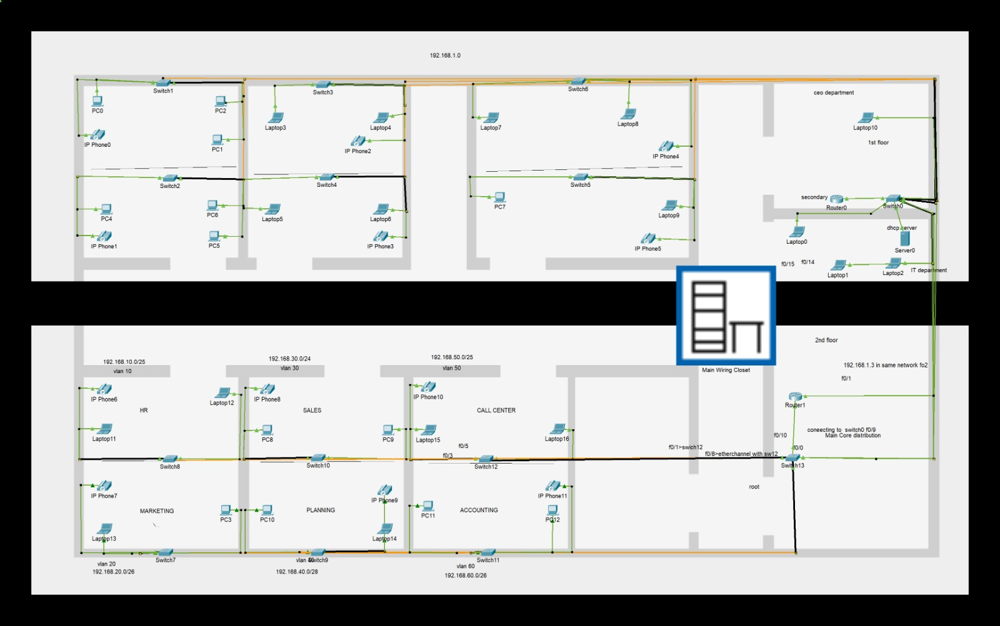

# Enterprise Campus Network
### Multi-Branch Infrastructure & Engineering Implementation

## 📌 Project Overview
An enterprise campus network designed and implemented using Cisco
networking technologies across two interconnected office blocks
(Upper and Lower floors), built and verified on Cisco Packet Tracer.

## 🏗️ Network Architecture
- VLAN segmentation
- Inter-VLAN Routing
- OSPF Area 0
- Rapid-PVST+
- LACP / EtherChannel
- DHCP Relay
- Cisco CME / VoIP
- QoS (30% priority bandwidth for voice)
- Extended ACLs

## 🌐 VLANs

| VLAN | Purpose | Network |
|------|---------|---------|
| 10 | Department 1 | 192.168.10.0/25 |
| 20 | Department 2 | 192.168.20.0/26 |
| 30 | Department 3 | 192.168.30.0/24 |
| 40 | Department 4 | 192.168.40.0/28 |
| 50 | Department 5 | 192.168.50.0/25 |
| 60 | Department 6 | 192.168.60.0/26 |
| 110–160 | Voice VLANs | 192.168.110.0 – 192.168.160.0 /28 |
| Core | Transit & Servers | 192.168.1.0/24 |

## ☎️ VoIP
Cisco CallManager Express (CME) with 12 Cisco 7960 IP Phones,
automated provisioning via DHCP Option 150.

## 🔐 Security
- Extended ACLs
- VLAN isolation
- SSH access restrictions

## 🧪 Verification
- Rapid-PVST+ verification
- EtherChannel verification
- OSPF convergence
- QoS verification
- End-to-end connectivity
- ACL security testing

## 📂 Project Files
- [📄 Full Documentation (PDF)](Enterprise_Campus_Network_Implementation.pdf) — complete design details and CLI configurations
- [🖧 Network Topology](Images/project_topology.png)
- [📦 Packet Tracer File](project.pkt) — open with Cisco Packet Tracer

## 👥 Team
- Malak Abdelaziz
- Bishoy Gerges

## 👨‍🏫 Instructor
[Instructor Name]
